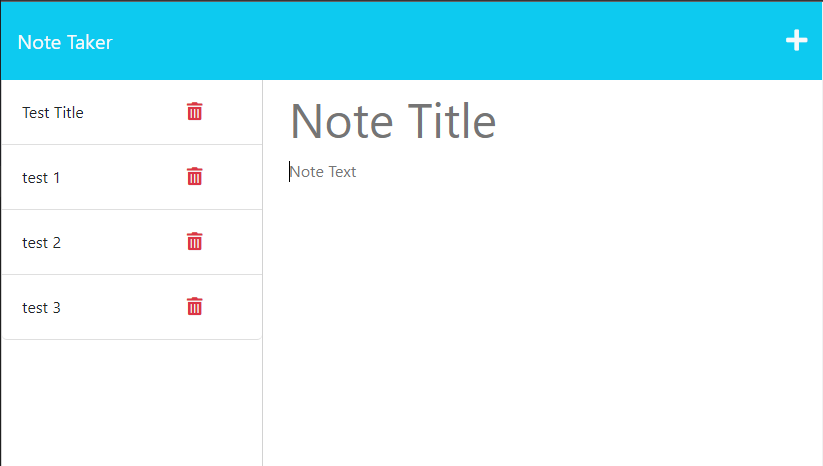

# EZ-Notes

[](https://opensource.org/licenses/MIT)

## Table of Contents

1. [Description](#description)
2. [Installation](#installation)
3. [Usage](#usage)
4. [License](#license)
5. [Contributing](#contributing)
6. [Tests](#tests)
7. [User Story/Acceptance Criteria](#user-story-and-acceptance-criteria)
8. [Questions](#questions)

## Description

View the Deployed application [here](https://immense-mountain-19342.herokuapp.com/).

This application is a Note Taker that can be used to write and save notes. This application will use an Express.js back end and will save and retrieve note data from a JSON file. This project uses starter code on the front end where I have built the back end, connect the two, and then deployed the entire application to Heroku. 

### Mock Up

The screenshot below shows the deployed page.
[](./assets/mockup-demo.png)

### Task Completed
The task here was to complete a project that would allow the user to create notes in a slick user interface. Autonomy is essential to become a proficient developer, and saving time generating crisp notes would aid in those efforts. This challenge should set myself up for future success by applying the core skills I've recently learned, meeting certain acceptance criteria with Express.js. The criteria are documented in the Acceptance Criteria section. 

## Installation

This project is deployed with Heroku, but a local installation may be used by downloading the repo. The application uses Express to incorperate my own API that I've created.

## Usage

This project is meant to provide an easy solution to taking quick notes on the fly. It can save the notes, delete them, and add tags to better organize thoughts presented in each note. It uses APIs to save the data to persist. 

## License

[](https://opensource.org/licenses/MIT)

This project is licensed under the MIT license.

## Contributing

To contribute to this repository, simply create a pull request, create issues, or reach out to me (see [Questions](#questions) below). I do my best to ensure that pull requests are up to date. 

## Tests

This application uses Jest for running unit tests. It uses unit test cases to render tests on each of the classes in the project and evaluates expectation for property values and methods. The test will fail if the actual functionality does not match the expected output: either the change is unexpected, or the reference  needs to be updated. After JEst is installed, the unit tests can be run with npm run test.

## User Story and Acceptance Criteria

### User Story
```
AS A small business owner
I WANT to be able to write and save notes
SO THAT I can organize my thoughts and keep track of tasks I need to complete
```

### Acceptance Criteria
```
GIVEN a note-taking application
WHEN I open the Note Taker
THEN I am presented with a landing page with a link to a notes page
WHEN I click on the link to the notes page
THEN I am presented with a page with existing notes listed in the left-hand column, plus empty fields to enter a new note title and the note’s text in the right-hand column
WHEN I enter a new note title and the note’s text
THEN a Save icon appears in the navigation at the top of the page
WHEN I click on the Save icon
THEN the new note I have entered is saved and appears in the left-hand column with the other existing notes
WHEN I click on an existing note in the list in the left-hand column
THEN that note appears in the right-hand column
WHEN I click on the Write icon in the navigation at the top of the page
THEN I am presented with empty fields to enter a new note title and the note’s text in the right-hand column
```

## Questions

If you have any questions, reach out to me through either of the methods below:
- [GitHub - J03B](https://github.com/J03B/)
- [email - (byucrazyfan@gmail.com)](mailto:byucrazyfan@gmail.com)
